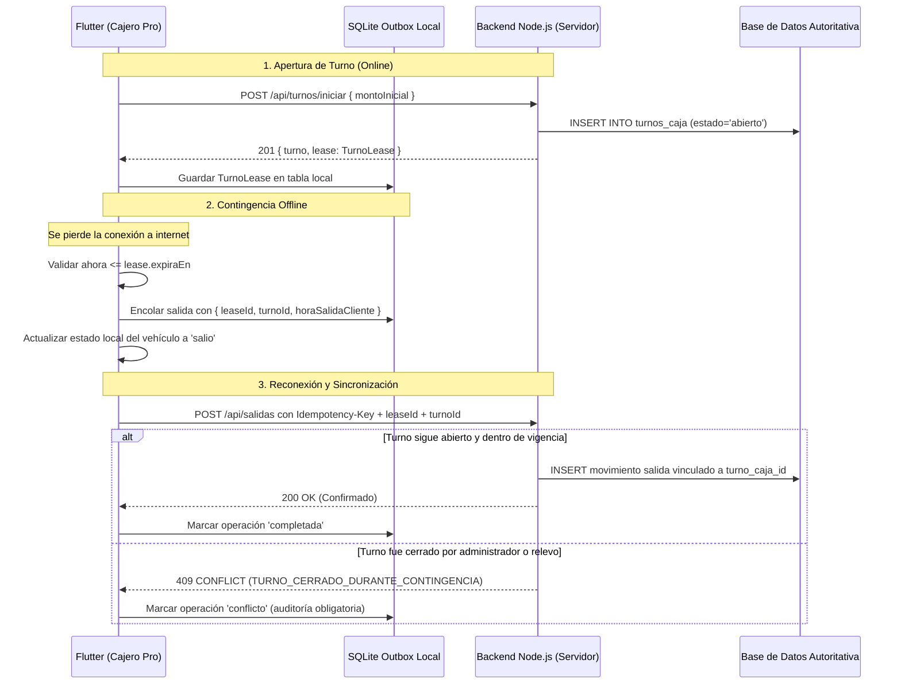

# Contrato de Lease para Turnos y Salidas Pro Offline

## 1. Problema y Fundamento Técnico

En el **Plan Pro** de ParkControl, la integridad contable se basa en un principio inmutable: **cada salida y cobro (efectivo, tarjeta, transferencia) debe estar estrictamente vinculado a un turno de caja abierto (`turnos_caja.id`)**.

Cuando un cajero pierde conexión a internet (*modo offline*):
1. **Riesgo de salidas huérfanas**: Si se permitieran salidas sin conexión sin control, al volver la red el turno original podría haber sido cerrado por un administrador, expirado o relevado por otro cajero.
2. **Riesgo de fraude o descuadre**: Un cajero podría registrar cobros con horas retroactivas que alteren arqueos de caja ya conciliados y firmados.
3. **Regla actual de seguridad**: Por estas razones, la regla vigente establece que **las salidas Pro requieren conexión** (`registrar_salida_screen.dart`), mientras que las entradas operativas sí pueden operar offline sin riesgo contable.

Para permitir en el futuro salidas Pro sin internet de forma matemáticamente segura, se define el presente **Contrato de Lease de Turno de Caja** (*Time-bounded Shift Lease*).

---

## 2. Definición del Lease de Turno

Un **Lease de Turno** es un arriendo criptográfico o certificado temporal emitido por el backend que autoriza a un dispositivo específico a imputar cobros y registrar salidas sobre un turno determinado durante una ventana de tiempo acotada.

### Estructura de Datos del Lease (`TurnoLease`)

```json
{
  "leaseId": "lease_8f3c2b1a-9e4d-4b71-9f20-1a2b3c4d5e6f",
  "turnoId": 142,
  "estacionamientoId": 12,
  "cajeroUsuarioId": 5,
  "emitidoEn": "2026-08-20T14:00:00.000Z",
  "expiraEn": "2026-08-20T22:00:00.000Z",
  "toleranciaMinutosGracia": 30,
  "versionConciliacion": 2,
  "estado": "activo"
}
```

---

## 3. Ciclo de Vida del Lease



---

## 4. Reglas de Validación en el Backend

Al recibir una salida asociada a un `leaseId`:

1. **Autenticidad**: El backend valida que el `leaseId` y `turnoId` fueron emitidos para el `estacionamiento_id` y `usuario_id` de la sesión activa.
2. **Vigencia Temporal**:
   $$\text{horaSalidaCliente} \le \text{lease.expiraEn} + \text{toleranciaMinutosGracia}$$
3. **Estado del Turno**:
   - **Caso A (Turno Abierto)**: La salida se inserta y totaliza en el arqueo del turno normalmente.
   - **Caso B (Turno ya cerrado)**: La salida **NO se inserta de forma silenciosa**. Se deriva a la tabla `turnos_caja_movimientos_contingencia` y se genera una alerta Pro inmediata para que el Administrador revise el desglose en el panel de auditoría.

---

## 5. Decisiones Comerciales Requeridas antes de Habilitar en Producción

Antes de activar el flag `habilitarSalidasProOffline: true` en el código, el propietario del producto debe definir:

| Decisión | Opciones en Evaluación | Estado |
| :--- | :--- | :--- |
| **Duración máxima del Lease** | 4 horas / 8 horas / 12 horas (duración estándar del turno) | Pendiente |
| **Tratamiento de cobros en turno cerrado** | Imputar retroactivamente recalculando diferencia vs. Crear turno extemporáneo de contingencia | Pendiente |
| **Emisión de comprobante en papel sin red** | Imprimir ticket local con aviso *"Pendiente de confirmación online"* | Pendiente |

---

## 6. Conclusión y Estado Actual

* La arquitectura y el modelo de datos están formalizados.
* Mientras las decisiones comerciales del punto 5 no estén ratificadas, el sistema **conserva de forma segura el bloqueo de salidas Pro offline** para evitar inconsistencias contables en los estacionamientos clientes.
